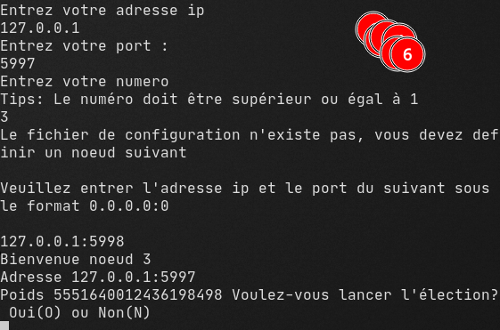

# Chang et Robert Algorithme d'élection
Algorithme de Chang et Robert 
Cours de systèmes distribués Institut National Polytechnique de Yamoussoukro

---

## Présentation de l'algorithme de Chang et Robert

**Hypothèse** : Les processus sont répartis le long d’un anneau virtuel unidirectionnel (les messages circulent toujours dans le même sens) fiable. Quand un site envoie un message, il est reçu par le site suivant sur l’anneau. Quand un site reçoit un message, ce message a été envoyé par le prédécesseur sur l’anneau.

**Principe** :
- Chaque processus possède un numéro inconnu des autres processus. Tous les numéros
sont distincts.
- Le problème est de savoir qui a le plus grand numéro. On utilise la propriété fondamentale de l’anneau : tout message émis fait un tour complet de l’anneau s’il n’est pas détruit, entre-temps. Quand un message revient sur le site qui l’a émis, on peut être sûr qu’il a été vu par tous les autres.
- La technique utilisée ici est la technique de filtrage. Si un site est candidat, il émet sa candidature avec son numéro. Si son message lui revient, c’est qu’il est élu. Sinon, un autre site l’aura détruit entre-temps.
- Lorsqu'un site reçoit un message d'élection, il y a 3 cas :
	-  numéro reçu est **supérieur** au sien : alors il transmet le message d'élection avec le même numéro au noeud suivant
	- numéro reçu est **inférieur** au sien : alors il transmet un nouveau message d'élection avec son numéro, il supprime celui qu'il a reçu
	- numéro reçu **égal** au sien: alors il transmet un message pour signifier que c'est lui l'élu


## Présentation du programme

### Vue sur le programme
- Le programme fonctionne entre plusieurs ordinateurs grâce à une communication TCP
- Le fichier ```ip.txt``` contient l'adresse du noeud suivant.
- Le format des adresses est le suivant : ```127.0.0.1:8080```
- Si un nouveau noeud qui n'appartient pas à l'anneau départ (ie : n'est le suivant de personne) alors un message de diffusion est envoyé aux noeuds de l'anneau pour l'ajouter à l'anneau.
- Si le fichier de configuration n'existe pas ou ne contient d'adresse ip alors le programme demande a l'utilisateur d'entree l'adresse ip du noeud suivant. Le format est identique a celui du fichier : `127.0.0.1:8080`


### Compilation
- Prérequis : **compilateur go**
- Exécuter la commande : ```go build .```  ou ```go build -o nom```
- Le fichier binaire généré sera nommé **main** dans le premier cas, dans le deuxième c'est le nom que vous aurez choisi
- Lancer le fichier binaire ainsi généré et suivre les instructions.


### Exécuter
- Vous pouvez directement exécuter les fichiers binaires générés par moi-même dans le projet
- Le fichier changAndRobertWin.exe pour *Windows* et le fichier changAndRobertLinux pour *Linux* et chandAndRobertMac pour *Mac*


### Demonstration du fonctionnement

Adresse : 127.0.0.1

Port : 5999

Numero de noeud : 1

Le poids (numero moi dans le cours) est attribue automatiquement 

L'utilisateur peut choisir de lancer l'election ou non

Le programme se met en attente des autres noeuds


Si Aucune adresse ne se trouve dans le fichier ou le fichier de configuration n'existe pas :


**Deroulement de l'election**

- noeud 2(a lance l'election)


- noeud 1


**Il y a transmission d'un message EXIT <_numero_du_noeud> lorsqu'un noeud quitte l'anneau avec la commande Ctrl+C**


S'il ne reste plus aucun noeud dans l'anneau le message **Plus aucun noeud dans l'anneau** s'affiche et le programme s'arrete.


**Arrivee d'un nouveau noeud**

- Le nouveau noeud a la possibilite de lancer une nouvelle election




---

## Auteur

 **Samuel Michaël Vanié** ✅
**Computer Sciences Engineering Student**
